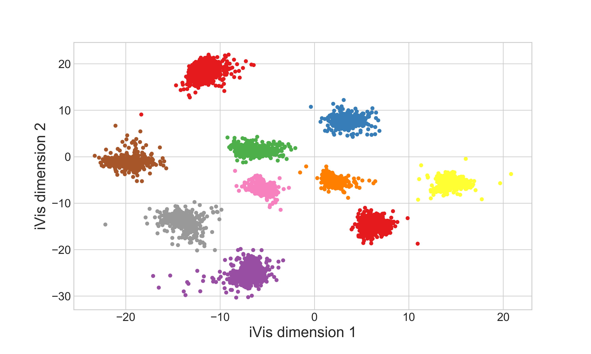

# Supervised ivis

Implementation of a supervised version of the ivis algorithm described in the paper: 'Structure-preserving visualisation of high dimensional single-cell data'.

This version of the algorithm uses a siamese neural network trained on triplets to reduce the dimensionality of data to two dimensions for visualization.
Each triplet is sampled from the provided labels, with points of the same label being pulled together and those that aren not being pushed away.

## Installation

After cloning this repo run: `pip install -r requirements.txt --editable .` from the root of the project.

## Examples

### Supervised embeddings

```
from keras.datasets import mnist
import numpy as np
from ivis_supervised import SupervisedIvis

(x_train, y_train), (x_test, y_test) = mnist.load_data()
x_test = np.reshape(x_test.astype('float32'), (len(x_test), 28 * 28))


model = SupervisedIvis()
embeddings = model.fit_transform(x_test, y_test)
```



### Training an a .h5 dataset

Load the data using a HDF5Matrix object provided by keras.  

When training on a .h5 file, it is suggested 
to set 'shuffle_mode' to 'batched' in order to prevent shuffling the whole .h5 dataset, which would be time-consuming 
to process due to the design of .h5 files.

```
from keras.utils.io_utils import HDF5Matrix

X_train = HDF5Matrix('test.h5', 'my_data')
Y_train = HDF5Matrix('test.h5', 'my_labels')

ivis = SupervisedIvis()
ivis.fit(X_train, Y_train, shuffle_mode='batch')

y_pred = ivis.transform(X_train)
```


Supervised ivis is free for non-commercial use. If you have any questions, please send queries to info "at" beringresearch.com

Copyright 2018 Bering Limited
